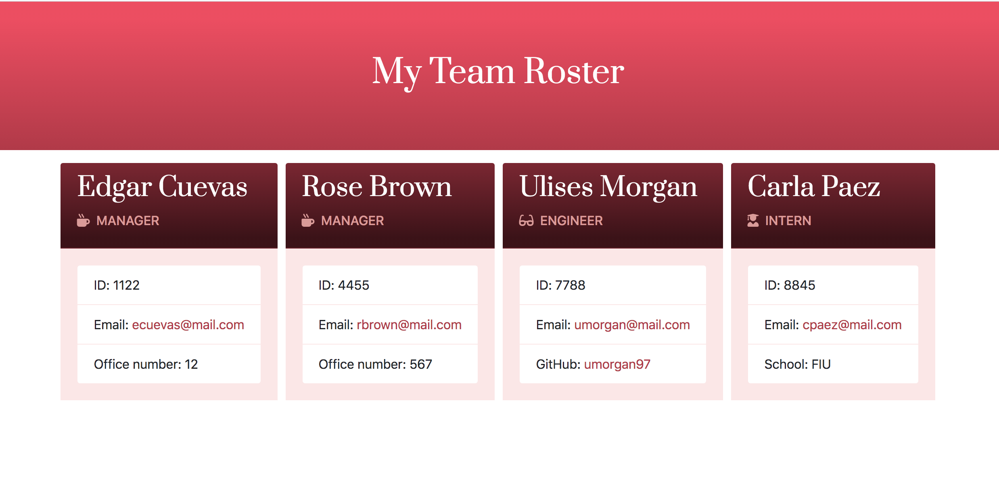

# Template Engine - Team Roster Generator

***Author: Enid Soto***

## Description

This is a command line application built in node.js and html. 

## Usage

The purpose of this app is to dynamically generate an HTML page using information obtained from the terminal. The app prompts the user for information about all the team members. The user can input any number of team members, and they may be a mix of engineers, managers and interns.

## Dependecies Used

The app uses "inquirer" for the user prompts, "jest" to run tests on the app's classes, and "fs" to create and write into a file.

## Functionality

1. The terminal prompts the user to add a manager, engineer or intern.
2. The terminal asks the user for general information about the team member and specific details depending on the team member's rank (manager, engineer or intern).
3. After all the information is collected, the terminal asks the user if they would like to add another team member. 
   - If yes, the user can select a new rank (manager, engineer or intern).
   - If no, all the information collected generates an html file where the user can find the final team roster.

## User Interface

The app uses bootstrap and fontawesome, as well as a few lines of custom css to set backgrounds, font colors and font families. This is a screenshot of the HTML output:

## Link to the Project's Repository

You can find the project files [here](https://github.com/enma1009/template-engine).
